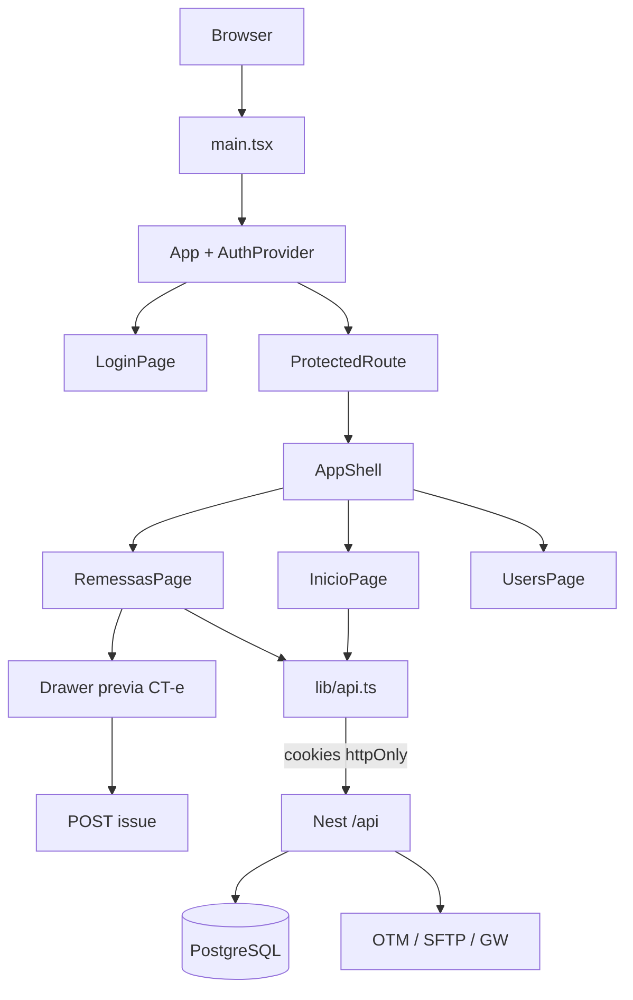

# Fluxo da aplicação — Portal FM Transportes

Modelo Distac (seções 1–4) com rotas e módulos da FM.

Complementos: [`ARQUITETURA-WEB.md`](ARQUITETURA-WEB.md) · [`seguranca.md`](seguranca.md) · [`DOMINIO-TECNICO.md`](DOMINIO-TECNICO.md).

---

## Visão geral

```
Browser (Vite :5190  ou  referencia-ui HTML)
  → React pages / AuthContext
  → lib/api.ts (cookies)
  → Nest API (:3000/api)
      Helmet → cookie-parser → CORS → Throttler → JwtAuthGuard → ValidationPipe
      → Controller → Service → Prisma → PostgreSQL
      → (jobs) OTM / SFTP / planilha → GW API
```



---

## 1. Init

| Passo | Onde |
|-------|------|
| Env | `.env` / `backend/.env` |
| Boot API | `backend/src/main.ts` — Helmet, prefix `/api`, Swagger |
| Boot UI | `frontend/src/main.tsx` → `App` → `AuthProvider` |
| DB | `npm run setup` — database `fm_auto` |

Mockup HTML continua em `referencia-ui/` (referência visual).

---

## 2. Auth

Login → cookies httpOnly → `ProtectedRoute` → shell. JwtStrategy exige usuário **ativo**.

---

## 3. Shell / Home

Menu: Início, Remessas. Hub chama `GET /api/dashboard/summary` (contagens: prontas, aguardando, divergência, emitidas).

---

## 4. Módulos de negócio

| UI | Página | API |
|----|--------|-----|
| `/remessas` | RemessasPage | `GET /api/shipments` |
| Prévia | drawer | `GET /api/shipments/:id/preview` |
| Emitir | ação | `POST /api/shipments/:id/issue` (503 — GW não habilitado) |
| `/usuarios` | UsersPage | `/api/users` |

Padrão de camadas Distac: Page → `resources.ts` → Controller → Service → Prisma (+ triggers). Não mudar esse fluxo HTTP.
