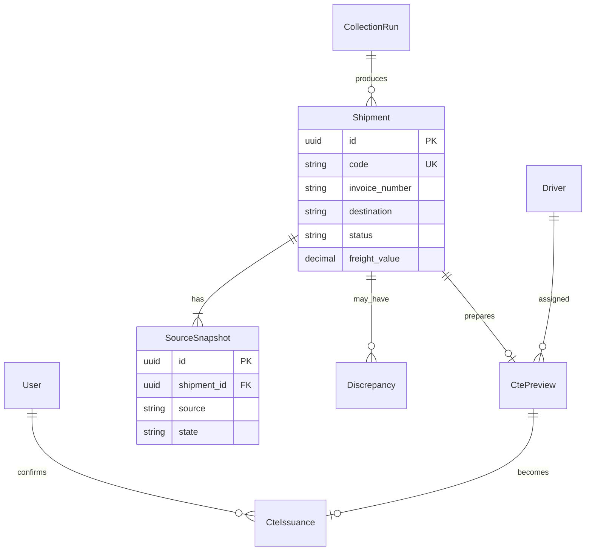

# Mapa de entidades — Portal FM Transportes

Documento vivo do domínio. Abordagem: [`docs/prottus/mapa-entidades.md`](../prottus/mapa-entidades.md).

Código/DB em **inglês**; labels de UI em **português**.  
Auth: `users`. Auditoria: `audit_log` (triggers) — `password_hash` omitido.

Nomes de tabela abaixo são **hipótese de modelagem** para o scaffold (não há schema Prisma ainda). Não inventar campos de API do GW que não foram mapeados.

---

## 1. Visão do domínio

A expedição emite CT-e a partir de remessas, em especial da **M. Dias**. No AS IS também existe Manifesto; **no 1º entregável o Manifesto está fora**. O dado nasce em três lugares que não conversam:

1. **OTM** (Oracle Logistics) — remessa aprovada; custos do CT-e e dados do CT-e em **duas telas** (não há relatório único).
2. **SFTP** — nota fiscal / carga; formato esperado NOTEFIZ; às vezes chega foto, XML ou PDF.
3. **Planilha Excel** — controle manual do que emitir (fonte de transição).

O operador reconcilia isso hoje olhando GW e OTM ao mesmo tempo. A plataforma guarda o cruzamento, mostra a prévia e, após confirmação, dispara a API do GW.

## 2. Áreas

| Área | Responsabilidade | Exemplos |
|------|------------------|----------|
| `auth` | Login JWT + usuários | `users` |
| `ingestion` | Coleta das três fontes | jobs, snapshots |
| `reconciliation` | Cruzamento e divergências | `shipments`, `source_snapshots`, `discrepancies` |
| `issuance` | Prévia, motorista, CT-e no GW | `cte_previews`, `cte_issuances` |
| `plataforma` | Auditoria DML | `audit_log` |

## 3. Entidades principais

| Entidade | Papel |
|----------|--------|
| User | Operador / coordenador / admin |
| Shipment | Remessa do dia (código, NF, destino, frete, situação) |
| SourceSnapshot | Estado de uma fonte (OTM, SFTP, spreadsheet) para uma remessa |
| Discrepancy | Divergência entre fontes (ex.: tributação OTM ≠ SFTP) |
| Driver | Motorista informado na prévia (nome; placa e vínculo existem na planilha — detalhe A definir) |
| CtePreview | Payload montado para conferência humana |
| CteIssuance | Resultado do disparo no GW (sucesso/falha, protocolo) |
| CollectionRun | Execução do robô de coleta (horário, totais) |
| AuditLog | Somente triggers |

Campos observados na planilha de controle (fonte real, não copiar PII para o git): motorista, placa(s), tipo de veículo, eixos, vínculo (SPOT / AGREGADO / FIXO), liberação seguradora, nº da carga, origem, destino, NF, volumes, km, entregas, valor da carga, valor do frete, frete motorista, tipo CT-e, tomador (ex.: MDIAS, BIMBO).

## 4. Diagrama

`source`: `OTM` | `SFTP` | `SPREADSHEET`  
`state` da fonte: `ok` | `wait` | `fail`  
`status` da remessa (UI): `pronta` | `aguardando` | `arquivo` | `divergencia` | `emitida`

## 5. Fluxos operacionais

1. **AS IS:** SFTP chega → lançamento na planilha → operador importa no GW (código ou arquivo) → dados frequentemente errados → conferência campo a campo no OTM → correção no GW → emite CT-e / Manifesto.
2. **TO BE (protótipo):** o RPA (Vini) traz as remessas reconciliáveis para o portal → lista → operador abre prévia, informa motorista, confirma. Integração de emissão no GW e coleta nativa OTM/SFTP neste repo: fase seguinte.

## 6. Telas

| Tela UI | API (planejado) | Entidades |
|---------|-----------------|-----------|
| `/login` | `/api/auth/*` | User |
| `/` | `/api/dashboard/summary` | CollectionRun, totais |
| `/remessas` | `/api/shipments` | Shipment, SourceSnapshot |
| Prévia (drawer) | `/api/shipments/:id/preview` + `POST .../issue` | CtePreview, Driver, CteIssuance |
| `/usuarios` | `/api/users` | User |

## 7. Decisões fechadas (2026-09-11)

- Manifesto: **fora** do 1º entregável
- API GW: não bloqueia o protótipo; foco no fluxo operacional
- CNPJ/endereço: fora deste protótipo
- “Central visual por setor”: fora — o produto agora é o fluxo da expedição, não um dashboard da empresa toda
- Origem dos dados de remessa no protótipo: RPA (Vini) + seed; este repo não constrói o coletor

Ainda em aberto (não bloqueia): percentual oficial M. Dias (50% vs ~80%) — não usar em documento externo.
